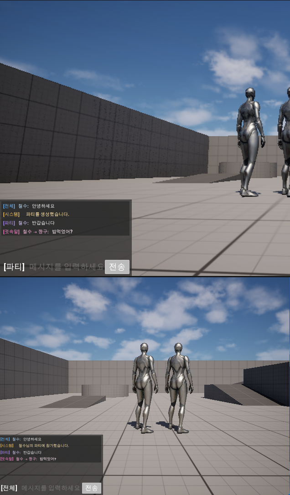

# MultiplayerChat Plugin

Unreal Engine 프로젝트에 멀티플레이 채팅 기능을 추가하는 런타임 플러그인입니다.

플레이어 간 전체 채팅, 귓속말, 파티 채팅을 지원하며 서버 검증을 통해 메시지를 전달합니다. 별도의 캐릭터 코드 수정 없이 `PlayerController`에 채팅 컴포넌트를 자동으로 장착하도록 구현했습니다.

## 주요 기능

- 서버 RPC와 클라이언트 RPC를 이용한 멀티플레이 채팅
- 모든 접속자에게 전달되는 전체 채팅
- 지정한 플레이어에게만 전달되는 귓속말
- 파티 생성·참가·탈퇴와 파티 전용 채팅
- 전체 및 파티 기본 발신 채널 전환
- 서버 검증을 거치는 세션 닉네임 변경
- 메시지 길이 및 연속 전송 제한
- 프로젝트의 플레이어 ID와 표시 이름 연동
- 채팅 UI 및 입력 키 자동 연결
- 레벨 전환 후 채팅 UI 자동 복구
- 최신 메시지 자동 스크롤
- 채팅 채널별 색상 표시
- 일정 시간이 지나면 채팅창이 사라지는 페이드 효과

## 사용 방법

멀티플레이 모드로 게임을 실행하면 `UMultiplayerChatAutoAttachSubsystem`이 각 `PlayerController`를 감지합니다.

서버는 다음 순서로 채팅 기능을 준비합니다.

1. 접속한 `PlayerController`를 찾습니다.
2. `UMultiplayerChatComponent`가 없으면 새로 생성합니다.
3. 컴포넌트 복제를 활성화합니다.
4. 로컬 플레이어에게 채팅 UI와 입력 기능을 연결합니다.
5. 레벨 전환으로 UI가 제거되면 자동으로 다시 생성합니다.

채팅창은 `Enter` 키로 활성화하고 `Escape` 키로 닫을 수 있습니다.

## 채팅 명령어

| 명령어 | 기능 |
|---|---|
| 일반 메시지 | 현재 기본 채널로 메시지 전송 |
| `/g 메시지` | 전체 채팅으로 전송하고 기본 채널을 전체로 변경 |
| `/p 메시지` | 파티 채팅으로 전송하고 기본 채널을 파티로 변경 |
| `/w 닉네임 메시지` | 지정한 플레이어에게 귓속말 전송 |
| `/nick 새닉네임` | 현재 세션의 닉네임 변경 |
| `/party create` | 새로운 파티 생성 |
| `/party join 닉네임` | 해당 플레이어가 속한 파티에 참가 |
| `/party leave` | 현재 파티에서 탈퇴 |

`/g` 또는 `/p` 뒤에 메시지를 입력하지 않으면 메시지를 보내지 않고 기본 발신 채널만 변경합니다.

## 프로젝트 구조

```text
Project7/Plugins/MultiplayerChat
├── Content
│   └── UI
│       ├── WBP_MultiplayerChat.uasset
│       └── WBP_ChatMessageRow.uasset
├── Resources
│   └── Icon128.png
├── Source
│   └── MultiplayerChat
│       ├── Public
│       │   ├── MultiplayerChat.h
│       │   ├── MultiplayerChatComponent.h
│       │   ├── MultiplayerChatIdentityProvider.h
│       │   └── MultiplayerChatTypes.h
│       ├── Private
│       │   ├── MultiplayerChat.cpp
│       │   ├── MultiplayerChatComponent.cpp
│       │   ├── MultiplayerChatAutoAttachSubsystem.h
│       │   └── MultiplayerChatAutoAttachSubsystem.cpp
│       └── MultiplayerChat.Build.cs
└── MultiplayerChat.uplugin
```

## 주요 클래스와 자료형

### `UMultiplayerChatComponent`

플레이어의 채팅 송수신을 담당하는 네트워크 컴포넌트입니다.

- 채팅 입력 및 슬래시 명령어 처리
- 서버·클라이언트 RPC 호출
- 전체 채팅, 귓속말, 파티 채팅 처리
- 닉네임 변경 요청 및 서버 검증
- 채팅 UI 생성과 입력 모드 전환
- 채팅 이벤트를 Blueprint와 UMG에 전달

### `UMultiplayerChatAutoAttachSubsystem`

게임 월드에 생성된 `PlayerController`를 감지하고 채팅 컴포넌트를 자동으로 장착하는 월드 서브시스템입니다.

이 구조를 사용해 프로젝트의 캐릭터 클래스나 `PlayerController`가 채팅 플러그인에 직접 의존하지 않도록 했습니다.

### `FMultiplayerChatMessage`

서버와 클라이언트가 주고받는 채팅 메시지 자료형입니다.

- 메시지 고유 ID
- 발신자 ID와 표시 이름
- 채팅 채널
- 채널 또는 파티 식별자
- 메시지 내용
- 서버 처리 시각

### `IMultiplayerChatIdentityProvider`

프로젝트에서 사용 중인 플레이어 ID와 표시 이름을 채팅 플러그인에 제공하기 위한 인터페이스입니다. 인터페이스를 구현하지 않은 프로젝트에서는 기본적으로 `PlayerState`의 ID와 플레이어 이름을 사용합니다.

## 네트워크 처리 흐름

```text
로컬 플레이어 입력
        ↓
UMultiplayerChatComponent
        ↓ Server RPC
서버 메시지 검증
        ↓
수신 대상 PlayerController 검색
        ↓ Client RPC
각 클라이언트의 채팅 컴포넌트
        ↓
Blueprint 이벤트 발생
        ↓
채팅 UI 출력
```

클라이언트가 보낸 발신자 이름이나 채널 정보는 그대로 신뢰하지 않습니다. 서버가 `PlayerState`와 채팅 컴포넌트의 상태를 확인한 뒤 최종 메시지를 생성합니다.

## 서버 검증

잘못된 입력이나 채팅 도배를 막기 위해 서버에서 다음 항목을 검사합니다.

- 빈 메시지 차단
- 메시지 최대 길이 256자
- 메시지 전송 최소 간격 0.5초
- 귓속말 대상 존재 여부
- 자기 자신에게 보내는 귓속말 차단
- 중복 닉네임 대상 차단
- 파티 참가 여부 확인
- 닉네임 길이 및 허용 문자 검사
- 예약 닉네임 사용 차단
- 닉네임 중복 검사
- 닉네임 변경 횟수와 요청 간격 제한

## 제작 과정

1. `MultiplayerChat` 런타임 플러그인의 기본 구조를 생성했습니다.
2. 채팅 채널과 메시지 정보를 저장할 자료형을 만들었습니다.
3. `UMultiplayerChatComponent`에 전체 채팅 RPC를 구현했습니다.
4. 서버에서 메시지를 검증하고 모든 클라이언트에 전달하도록 구성했습니다.
5. UMG 기반 채팅창과 메시지 행 위젯을 제작했습니다.
6. 채팅 UI 자동 생성과 `Enter`·`Escape` 입력 처리를 추가했습니다.
7. 플레이어 식별 인터페이스와 닉네임 변경 기능을 구현했습니다.
8. 귓속말과 서버 기반 수신자 검증 기능을 추가했습니다.
9. 파티 생성·참가·탈퇴 및 파티 채팅을 구현했습니다.
10. 월드 서브시스템을 사용해 채팅 컴포넌트가 자동으로 장착되도록 개선했습니다.
11. 레벨 전환 후 UI 복구, 자동 스크롤, 채널 색상과 페이드 효과를 추가했습니다.

## 멀티플레이 테스트

Unreal Editor의 Play 설정에서 플레이어 수를 2명 이상으로 설정하고 `Play As Listen Server`로 실행해 다음 항목을 확인했습니다.

- 각 플레이어가 전체 메시지를 수신하는지
- 귓속말이 발신자와 수신자에게만 표시되는지
- 파티 메시지가 같은 파티 플레이어에게만 표시되는지
- 파티 생성·참가·탈퇴 결과가 시스템 메시지로 전달되는지
- 잘못된 명령어와 입력이 서버에서 거부되는지
- 닉네임 변경 결과가 UI에 표시되는지
- 레벨 전환 후 채팅 UI가 다시 표시되는지
- 최신 메시지로 자동 스크롤되는지

아래 화면은 두 명의 플레이어로 전체 채팅, 파티 생성·참가, 파티 채팅과 귓속말 송수신을 테스트한 결과입니다.



## 현재 제한 사항

- 파티와 닉네임 정보는 현재 서버 세션 동안만 유지됩니다.
- 별도의 데이터베이스나 영구 저장 기능은 없습니다.
- Standalone 모드에서는 자동 장착 서브시스템이 채팅 컴포넌트를 생성하지 않습니다.
- 기본 UI는 플러그인에 포함된 UMG 위젯을 사용합니다.

## 사용 기술

- C++
- UMG
- Server/Client RPC
- `UActorComponent`
- `UWorldSubsystem`
- Blueprint Event
